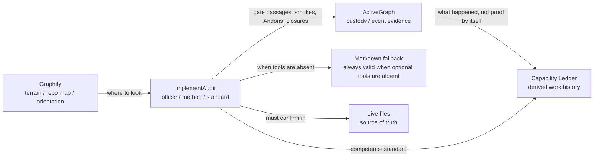
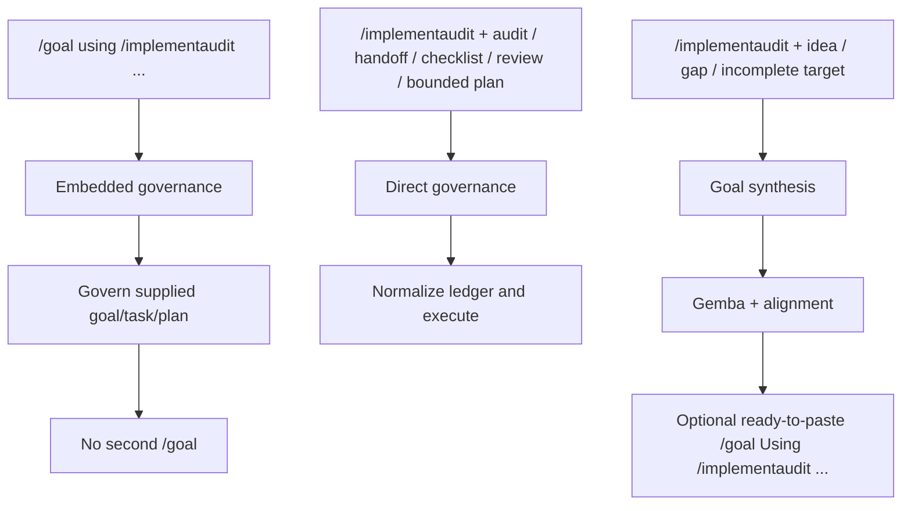
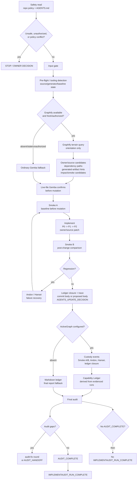

# IMPLEMENTAUDIT.md

`IMPLEMENTAUDIT.md` defines `/implementaudit`: a repo-generic method for turning
audit findings, handoffs, checklists, reviews, goals, tasks, gaps, and
implementation plans into bounded, verified repository changes.

It is for audit closure and repo hygiene: read the real repo, find the
owner/source, make the smallest warranted change, prove only what the evidence
supports, and close the ledger. It is not a release bot, package publisher,
provenance system, or generic autonomous-build loop.

It does not assume a framework, language, CI system, release convention, package
host, or optional toolchain. Its default authorization stance is:

```text
No commit. No push. No tag. No release. No publication. No provenance.
```

Each action requires separate explicit authorization.

## Runtime at a glance

```text
Input artifact -> Gemba -> owner/source patch -> Smoke A/B -> trace -> final audit
```

The small loop closes one supplied audit/handoff/checklist/review/plan. The
larger package loop can synthesize a bounded `/goal` handoff when the user gives
only an idea, gap, or incomplete target.

## What it is

`/implementaudit` is the officer/method layer for audit closure and repo hygiene.
It is an audit-governed implementation skill: it routes work through repo-local
owner/source discovery, acceptance criteria, rollback/evidence planning,
fixtures/checkers, and smoke-before-claim closure. It can help implement
changes, but only through the audit contract; it is not a generic autonomous
build runner.

Current optional-tooling architecture:

<!-- BEGIN: implementaudit-diagram:tooling-architecture -->



<!-- END: implementaudit-diagram:tooling-architecture -->

Graphify and ActiveGraph are optional. `/implementaudit` remains fully usable
when neither tool is installed.

Graphify and ActiveGraph are optional but strategically important: Graphify
improves orientation before mutation, while ActiveGraph preserves custody after
evidence is produced. Neither replaces ImplementAudit's gates; both strengthen
the audit trail when available.

## Invocation modes

`/implementaudit` has three invocation shapes:

<!-- BEGIN: implementaudit-diagram:invocation-modes -->



<!-- END: implementaudit-diagram:invocation-modes -->

- **Embedded governance mode**: a host goal/task/plan already exists, such as
  `/goal using /implementaudit ...`. ImplementAudit governs that active target
  and does not print a second `/goal`.
- **Direct governance mode**: the user supplies a concrete audit, handoff,
  checklist, review, or bounded implementation plan. ImplementAudit normalizes
  it into a ledger and executes.
- **Goal-synthesis mode**: the user supplies an idea, gap, incomplete target, or
  request for the next best implementation prompt. ImplementAudit performs
  enough Gemba and alignment work to produce a bounded handoff, and may print
  one ready-to-paste `/goal Using /implementaudit ...` line.

## Default behavior

The default small audit implementer mode works on one audit, handoff, checklist,
review, or implementation plan.

It:

- validates that the input is a recognizable audit artifact
- normalizes findings into a ledger
- classifies items as `P0`, `P1`, `P2`, `OWNER DECISION`, `DEFERRED`, or
  `OUT OF SCOPE`
- processes work in `P0 -> P1 -> P2` order
- patches owner/source, not nearest symptom
- requires evidence for every claim
- closes every item as `done`, `changed`, `blocked`, `deferred`, or
  `unverified`

No ledger item may remain open at final response.

## Greenfield / brownfield routing

ImplementAudit classifies work before planning or mutation:

- **Greenfield**: a new governed artifact, fixture family, checker, reference,
  workflow, runtime capability, sidecar contract, or validation surface is being
  introduced and has no established repo owner/source yet.
- **Brownfield**: an existing repo artifact, owner/source, generated output,
  fixture, checker, contract, or documented invariant is being repaired,
  verified, or closed.
- **Mixed**: a new artifact is introduced inside an established repo. The outer
  shell is brownfield; the new artifact receives greenfield intake after the
  existing repo surface is inspected.

Greenfield work must define owner/source, scope and non-scope, constraints,
acceptance criteria, rollback/removal path, evidence plan, generated-artifact
plan, sidecar status, and canonical-vs-sidecar boundaries before implementation.

Brownfield work must inspect existing owner/source, contracts, tests, smokes,
checkers, generated artifacts, optional sidecars, regression surface, and
rollback path before mutation.

Graphify may orient brownfield terrain when available and fresh, but live files
remain source of truth. ActiveGraph may preserve custody when configured, but
Markdown ledgers and final reports remain valid fallback. Neither optional
sidecar replaces repo-local owners, fixtures, checkers, smoke output, or audit
ledgers.

## Operating method

The method combines:

- **PDCA**: plan the smallest safe change, do it, check evidence, then
  standardize or revise.
- **Gemba**: inspect the real place of work, not summaries when live artifacts
  exist.
- **Smoke Before Claim**: tag every behavior claim with the smallest meaningful
  evidence.
- **Smoke A / Smoke B**: capture the pre-change baseline, then compare
  post-change checks to detect regressions.
- **Andon**: surface blockers, failures, unclear ownership, or unsafe
  conditions immediately.
- **Hansei**: reflect after gaps, regressions, false passes, or failures.
- **5 Whys**: trace symptoms to root cause when the situation warrants it.
- **Plan Closure**: map every item to a terminal status.

Static checks, local generated-runtime evidence, manual inspection, browser
evidence, package-bound checks, unit tests, and live runtime checks are not
interchangeable. Proof claims must not exceed the evidence type.

## Execution gates

The gate diagram shows the normal path and the places where the method must
stop, recover, or hand off instead of pretending the run is complete.

<!-- BEGIN: implementaudit-diagram:execution-spine -->



<!-- END: implementaudit-diagram:execution-spine -->

| Gate | Purpose |
|---|---|
| Safety read | Read repo instructions, safety defaults, authorization gates, and `AGENTS.md` conflict rules. |
| Input gate | Confirm the input is a valid audit artifact. |
| Pre-flight | Detect optional tooling, confirm write access, source/generator ownership, authorization chain, repo constraints, and prior run state. |
| Smoke A | Run and classify baseline checks before mutation. |
| Implement | Patch items atomically in priority order and guard scope creep. |
| Smoke B | Compare post-change checks against Smoke A and trigger regression protocol when needed. |
| Trace | Preserve causal history in commit body or proposed commit body, ledger, optional Capability Ledger, and `AGENTS.md` only when warranted. |
| Self-check | Verify quality-bar invariants before final response. |

If an audit finding contradicts repo-local `AGENTS.md` or policy, the conflict
becomes `OWNER DECISION`. The agent does not silently choose which instruction
wins.

## Package layout

This repo uses the flat package layout declared by `AGENTS.md`:

```text
skills/SKILL.md
skills/references/
skills/scripts/
skills/templates/
```

`IMPLEMENTAUDIT.md` remains the compatibility root. `skills/SKILL.md` is the
packaged skill copy. In the current package contract, they must stay
synchronized.

Package metadata lives under `.claude-plugin/`:

```text
.claude-plugin/plugin.json
.claude-plugin/marketplace.json
```

The manifest JSON is validated by `scripts/verify-package.sh`. This README does
not claim that Claude Code marketplace behavior, Codex installation, release,
publication, or provenance has been verified.

Current project milestone: `v0.2.2.0`. Plugin manifest version: `0.2.2`.
No local schema evidence proved four-component plugin manifest versions are
accepted, so the manifest uses host-conservative package metadata while the
project milestone is recorded in docs and changelog. This is not a tag, release,
publication, or provenance claim.

There is no `LICENSE` file in this repo yet. License selection remains an owner
decision.

## Child-agent review loops

`/implementaudit` may use child agents or subagents as bounded review loops when
the host supports them, or may simulate the same pattern as separate written
read-only audit passes.

The package includes `skills/references/child-agents.md` and
`skills/templates/child-agent-report.md` as explanatory/reference material.
Instruction precedence remains with the repo's `AGENTS.md` hierarchy. Root
`AGENTS.md` holds repo-wide child/subagent rules; scoped `AGENTS.md` or
`AGENTS.override.md` is used only for subtree-specific guidance when that
host/repo convention is available.

Child-agent reports do not prove correctness and do not authorize edits,
commits, pushes, installs, indexing, exports, releases, publication, or
provenance. The main `/implementaudit` agent must normalize reviewer findings
into the ledger and inspect live files before patching or closing them.

## Optional tooling

Optional tooling can improve orientation and custody, but it does not change
`/implementaudit` safety rules.

Tool installation, Graphify indexing, ActiveGraph event-store setup,
ActiveGraph export, local commit, push, tag, release, publication, and
provenance are separate gates. Installing a tool does not authorize any later
action.

### First-run onboarding

On first runs, `/implementaudit` may detect Graphify and ActiveGraph
availability. Missing tools are not errors.

Default behavior:

- detect and record availability
- continue safely without optional tooling when absent
- print install/configure commands as documentation when useful
- install or configure tools only with explicit authorization such as
  `/implementaudit --onboard-tools` or a direct user instruction

Documented onboarding commands:

```bash
uv tool install graphifyy
graphify install --platform codex
graphify install --project --platform codex

pip install activegraph
activegraph quickstart
```

These commands are documentation only in this repo state. Running them requires
explicit authorization. Installation does not authorize indexing, event-store
setup, export, commit, push, tag, release, publication, or provenance.

### Graphify-assisted Gemba

Graphify is the optional catalog / terrain map. When available and fresh, or
when indexing/querying is explicitly authorized, `/implementaudit` can query it
before touching the scene.

Graphify can help identify:

- owner/source candidates
- dependency paths
- generated-artifact hints
- impact surfaces
- smoke/test candidates
- scope-creep signals
- stale assumptions
- source/generated output relationships

Graphify output is orientation evidence, not proof. It does not prove
correctness, decide closure, authorize mutation, replace live-file inspection,
override repo instructions, or weaken `AGENTS.md`.

Graphify terrain tagged `INFERRED` or `AMBIGUOUS` requires live-file
confirmation before implementation, closure, or proof claims. Live files win
over graph output. If Graphify is absent or stale, `/implementaudit` falls back
to ordinary Gemba.

### ActiveGraph-backed Capability Ledger

ActiveGraph is the optional evidence locker / custody substrate. When
configured, ActiveGraph-backed `/implementaudit` runs may derive Capability
Ledger entries as the natural custody-backed output of the run.

The Capability Ledger / Officer CV is ImplementAudit-derived. It is not an
upstream ActiveGraph built-in feature. ActiveGraph provides the event custody
substrate; ImplementAudit derives capability entries from recorded gate passages
and evidence.

Entries may include:

- run id
- repo identity
- finding class
- owner/source
- countermeasure
- Graphify terrain context, if available
- ActiveGraph custody events, if available
- authorization gates respected
- Smoke A and Smoke B
- regression / Andon / Hansei trail, if any
- final status
- remaining risk

When ActiveGraph is absent, the ordinary Markdown ledger and final report remain
first-class fallback. The run is not blocked merely because ActiveGraph is
unavailable.

## Evidence boundaries

Interop boundaries are explicit:

- Graphify-supported behavior must be distinguished from ImplementAudit
  heuristics.
- Graphify summaries and graph output are not proof.
- ActiveGraph custody is not correctness proof.
- ImplementAudit custom adapter events are not upstream ActiveGraph built-ins
  unless explicitly identified as such.
- ActiveGraph policies gate graph object proposals, graph patches, and wrapped
  behaviors/tools/proposals.
- ActiveGraph does not inherently gate shell commands, git commit, git push,
  tag, release, publication, or provenance unless those actions are modeled
  through wrapped ActiveGraph behavior/tool/proposal semantics.
- Object/relation mappings are ImplementAudit-specific or Diligence-style
  adapter mappings, not upstream ActiveGraph base types.
- Release and provenance claims require separate authorization and evidence.

## Usage examples

```text
/implementaudit < audit.md
/implementaudit implement these findings
/implementaudit --onboard-tools
/goal using /implementaudit, close the findings in AUDIT.md
```

Natural-language requests such as "implement these findings", "act on this
audit", "close these items", or "work through this handoff" also invoke the
method when the input is a valid audit artifact.

## Install notes

Install flows are documented here but not verified in this repo state.

Manual Codex-style copy example:

```bash
mkdir -p ~/.codex/skills/implementaudit
cp -R skills/* ~/.codex/skills/implementaudit/
```

PowerShell equivalent:

```powershell
New-Item -ItemType Directory -Force "$env:USERPROFILE\.codex\skills\implementaudit" | Out-Null
Copy-Item -Recurse -Force .\skills\* "$env:USERPROFILE\.codex\skills\implementaudit\"
```

Claude Code/plugin consumers should use the host's current plugin instructions
with `.claude-plugin/plugin.json` as package metadata. This repo validates the
JSON shape only; it does not claim host install or marketplace behavior was
tested.

## Upgrade / reinstall

After a release, reinstall or update the skill in the host you use. Do not
assume a local copied skill has updated just because the GitHub repo has a new
release.

For Codex manual installs, there is no marketplace auto-update path documented
in this repo. Repeat the documented copy step after each release:

```bash
mkdir -p ~/.codex/skills/implementaudit
cp -R skills/* ~/.codex/skills/implementaudit/
```

PowerShell:

```powershell
New-Item -ItemType Directory -Force "$env:USERPROFILE\.codex\skills\implementaudit" | Out-Null
Copy-Item -Recurse -Force .\skills\* "$env:USERPROFILE\.codex\skills\implementaudit\"
```

Claude Code/plugin users should use the host's documented plugin update or
reload flow when available. This repo does not claim that plugin update,
marketplace refresh, install, release, publication, or provenance behavior has
been verified.

## Release asset notes

For package release gates, including `v0.2.2.0`, the GitHub release asset name is
`IMPLEMENTAUDIT.skill`.

No local evidence proves `.skill` is a universal host-standard archive format.
In this repo, `IMPLEMENTAUDIT.skill` is the GitHub release artifact name. It is
a ZIP-format archive containing the installable skill payload:

```text
skills/
docs/diagrams/
docs/audits/
.claude-plugin/
IMPLEMENTAUDIT.md
README.md
CHANGELOG.md
```

Build and validate it locally with:

```bash
bash scripts/build-release-asset.sh
```

`scripts/verify-package.sh` also runs the builder in `--check` mode and validates
the extracted package shape.

When provenance is explicitly authorized for a release gate, this repo may
publish a checksum manifest such as `CHECKSUMS.txt` for `IMPLEMENTAUDIT.skill`.
A checksum manifest is not a signature, attestation, SBOM, license, marketplace
verification, or install verification.

The artifact must not include `.IMPLEMENTAUDIT/` run artifacts, local smoke
debris, Graphify outputs, ActiveGraph stores, secrets, git metadata, or
untracked diagnostics. Attaching `IMPLEMENTAUDIT.skill` to GitHub Releases is a
separate release-gate action. Ordinary audits, local commits, and push-only
gates do not authorize upload, release, publication, marketplace verification,
or provenance claims.

## Safety defaults

Never do these unless explicitly authorized and allowed by repo policy:

- commit
- push
- tag
- publish
- create or update releases
- delete data
- alter credentials or secrets
- rewrite history
- commit raw diagnostic outputs
- hand-edit generated artifacts when a source generator exists
- claim proof without evidence

Local commit authorization does not imply push authorization. Push authorization
does not imply tag, release, publication, or provenance authorization.

If local commits are authorized, commit bodies carry the causal trace: finding,
owner/source, root cause when relevant, Andon/Hansei/5 Whys when triggered,
countermeasure, changed files, Smoke A/B, boundaries preserved, and deferred
follow-up.

If local commits are not authorized, the final report includes a proposed commit
message/body instead.

## What this does not do

`/implementaudit` does not:

- make Graphify or ActiveGraph hard dependencies
- silently install tools
- silently run indexing
- silently create ActiveGraph config or event stores
- silently export custody events
- treat install success as audit proof
- treat Graphify output as correctness proof
- treat ActiveGraph custody as correctness proof
- push, tag, release, publish, or make provenance claims without explicit
  authorization
- resolve audit-vs-`AGENTS.md` conflicts by agent judgment
- use `AGENTS.md` as a raw evidence dump

## Development / maintenance notes

`AGENTS.md` is the authoritative repository contract. `IMPLEMENTAUDIT.md` and
`skills/SKILL.md` are synchronized under the current flat package contract.

README Mermaid diagrams are generated from `docs/diagrams/*.mmd`; do not edit
diagram blocks by hand. Refresh or check them with:

```bash
bash scripts/generate-readme-diagrams.sh
bash scripts/generate-readme-diagrams.sh --check
```

Validation scripts are POSIX shell scripts. On Windows, run them from Git Bash
or WSL.

Before committing package changes, run:

```bash
git diff --check
python -m json.tool .claude-plugin/plugin.json
python -m json.tool .claude-plugin/marketplace.json
bash scripts/verify-package.sh
```

Also run:

```bash
bash skills/scripts/validate-phase.sh skills/templates/phase-goal.txt
```

Preserve the distinction between:

- upstream-supported behavior
- ImplementAudit custom extension
- repo-local heuristic
- unsupported or uncertain behavior

Detailed evidence belongs in commit bodies, orchestrator/audit ledgers,
ActiveGraph custody events when configured, or final reports. Durable
anti-repeat rules may belong in repo-local `AGENTS.md` when they would prevent
future agents from repeating the same mistake.
