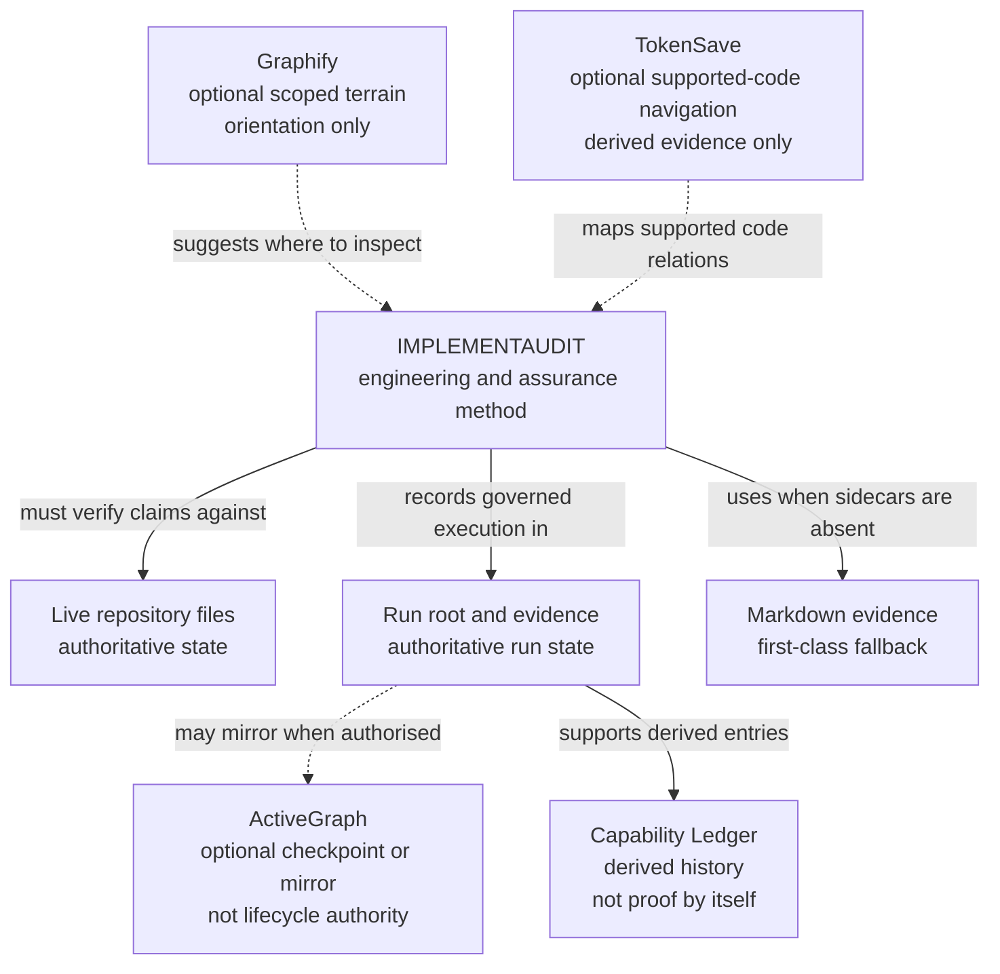
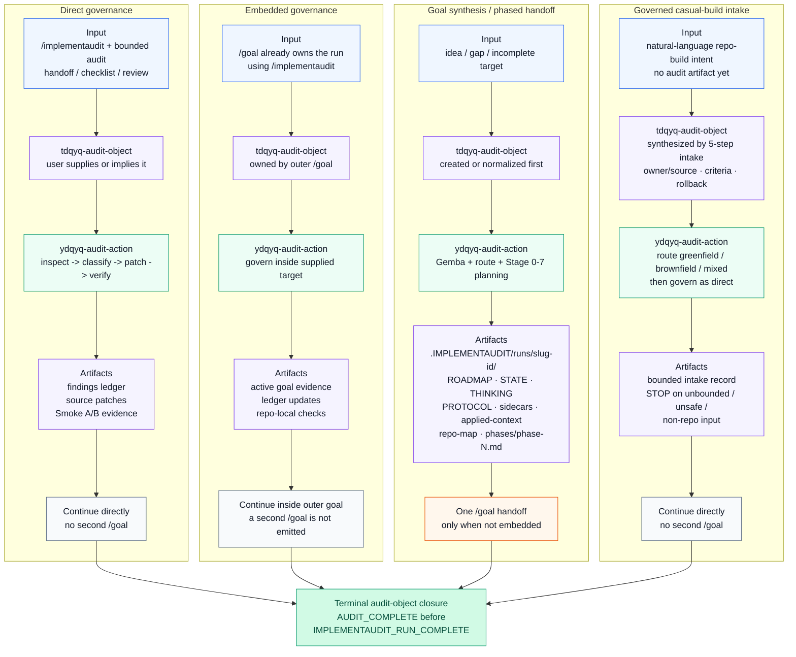
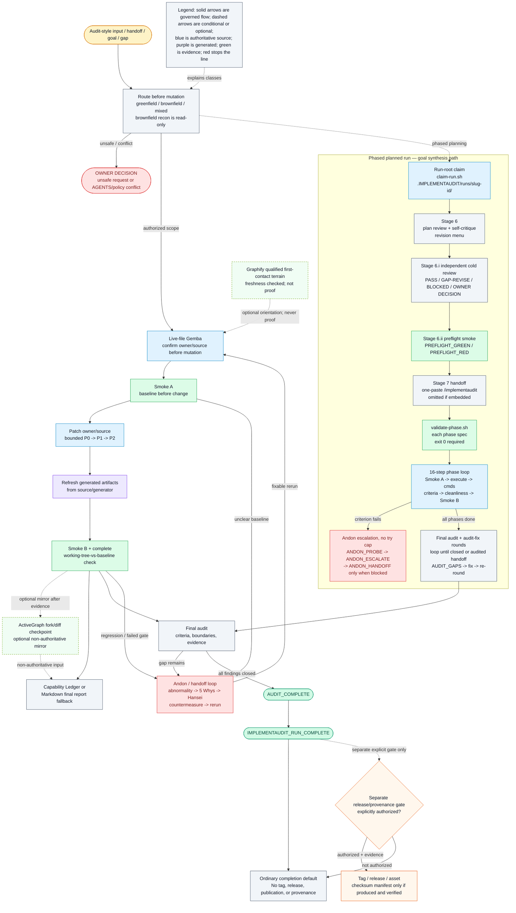

# IMPLEMENTAUDIT.md
[](https://skills.sh/theislampill/IMPLEMENTAUDIT.md)
> A self-correcting system of nested engineering loops: 
> plan & execute repo work; safely implement audit findings; 
> design greenfield & improve brownfield; learn from failures; 
> re-verify until closure.

`IMPLEMENTAUDIT.md` names this repo and workflow: audited implementation driven
by an `AUDIT.md`-style evidence/input artifact. 
The `.md` in the repo name is branding and lineage, not a required root behavior file.

`skills/implementaudit/SKILL.md` defines `/implementaudit`: a repo-generic method 
for turning audit findings, handoffs, checklists, reviews, goals, tasks, gaps, and
implementation plans into bounded, verified repository changes. It plans deeply
and executes verified repo work phase-by-phase until terminal auditable closure 
or an explicit audited handoff.

It is reusable meta-engineering packaged as `IMPLEMENTAUDIT.skill`: sustained
engineering discipline for planning, designing, implementing, improving,
reviewing, recovering, integrating, and closing repository work—not only a
one-off code audit. A skill or agent-tooling repository can itself be the audit
object, so the method can improve skills-about-skills through the same
owner/source, evidence, and closure gates. This repository dogfoods that
self-application; it does not establish effectiveness across every agent, host,
repository, or external ecosystem. Here, `.skill` is the release-asset name and
import layout, not a claimed universal host standard.

It can plan, design, implement, improve, 
review, recover, integrate, and close repo work. 
Greenfield and replacement work can route through DMADV; 
brownfield improvement can route through DMAIC; 
mixed work can use both where warranted.
Across those routes, nested planner, run, phase, Andon, 
and audit-fix loops inspect the live repository, identify owner/source, 
make the smallest warranted change, learn from failures, 
and re-verify until terminal closure or an explicit audited handoff.

The method scales its ceremony to consequence. Small reversible work can stay
compact; deeper planning, durable run state, independent review, package checks,
or external readback activate only when scope, risk, dependencies, or the claimed
evidence surface warrant them. Process volume alone is not engineering value.

It is not an ungated autonomous build loop, release bot, package publisher, or
provenance system. Blocked work ends in an explicit audited handoff, not fake
completion.

It does not assume a framework, language, CI system, release convention, package
host, or optional toolchain. Its default authorisation stance is:

```text
No commit. No push. No tag. No release. No publication. No provenance.
```

Each action requires separate explicit authorisation.

## Contents

- [Quick start](#quick-start)
- [Runtime at a glance](#runtime-at-a-glance)
- [Why IMPLEMENTAUDIT is stronger than a bare `/goal`](#why-implementaudit-is-stronger-than-a-bare-goal)
- [What it is](#what-it-is)
- [Quick vocabulary, not authority](#quick-vocabulary-not-authority)
- [How an audit input drives a run](#how-an-audit-input-drives-a-run)
- [How IMPLEMENTAUDIT audits](#how-implementaudit-audits)
- [Invocation modes](#invocation-modes)
- [Native planner stages](#native-planner-stages)
- [Default behavior](#default-behavior)
- [Greenfield / brownfield routing](#greenfield--brownfield-routing)
- [Operating method](#operating-method)
- [Execution gates](#execution-gates)
- [Loopability, Andon, and handoff states](#loopability-andon-and-handoff-states)
- [Artifacts and outputs](#artifacts-and-outputs)
- [Skill internals / repository layout](#skill-internals--repository-layout)
- [Version and release notes](#version-and-release-notes)
- [Child-agent review loops](#child-agent-review-loops)
- [Optional tooling](#optional-tooling)
- [Evidence boundaries](#evidence-boundaries)
- [Usage examples](#usage-examples)
- [Install notes](#install-notes)
- [Upgrade / reinstall](#upgrade--reinstall)
- [Release asset notes](#release-asset-notes)
- [Validation and release evidence](#validation-and-release-evidence)
- [Safety defaults](#safety-defaults)
- [What this does not do](#what-this-does-not-do)
- [Contributing and deeper documentation](#contributing-and-deeper-documentation)

## Quick start

1. Choose the installation route in [Install notes](#install-notes). The
   current release identity is `v0.3.3.3`; its host-facing runtime remains
   `0.3.3`. The final correction candidate is a qualified 257,998-byte package
   with SHA-256
   `0e10a21600062c6f7cd440a6efb0ff3b795ce1a01067efb4005c7a176db02413`.
   A checkout of `main`, a locally built archive, and the public release asset
   remain distinct until publication and byte-for-byte readback are complete.

2. Invoke `/implementaudit` with a bounded repository target. Common shapes
   include:

   ```text
   /implementaudit close the findings in AUDIT.md
   /implementaudit plan and execute this bounded repo change
   /implementaudit design this new governed capability
   /implementaudit improve this existing subsystem without regressions
   /implementaudit audit this repo and produce the next executable plan
   ```

   Unbounded or unsafe requests produce an explicit STOP or owner-decision
   boundary, not an uncontrolled build loop.

3. IMPLEMENTAUDIT classifies the work as greenfield, brownfield, or mixed;
   selects the warranted planning and improvement route; and then executes
   through its nested planner, run, phase, Andon, and audit-fix loops.

   Depending on the work, outputs may include owner/source discovery,
   acceptance and rollback planning, a findings ledger, `Smoke A` baseline
   evidence, bounded patches, `Smoke B` comparison, independent review,
   run-root state, and terminal transcript markers ending in
   `AUDIT_COMPLETE` plus `IMPLEMENTAUDIT_RUN_COMPLETE`—or an explicit audited
   handoff with the evidence and next actions needed to resume.

   Phased runs write their plan and state under
   `.IMPLEMENTAUDIT/runs/<task>-<id>/`. The full loop structure is in
   [Loopability, Andon, and handoff states](#loopability-andon-and-handoff-states);
   the shipped helper scripts are catalogued in the docs portal’s package
   contents and shipped-scripts reference.

4. Nothing is committed, pushed, tagged, released, or published unless you
   explicitly authorise that action.

## Runtime at a glance

```text
goal / audit / plan / repo task
    ↓
bounded audit object
    ↓
live-repo Gemba + owner/source discovery
    ↓
greenfield / brownfield / mixed routing
    ↓
plan / design / improve / implement
    ↓
Smoke A/B + evidence + review
    ↓
Andon → evidence → Hansei → proportional 5 Whys → countermeasure
    ↓
re-verification
    ↓
AUDIT_COMPLETE or explicit audited handoff
```

IMPLEMENTAUDIT is not one flat retry loop. 
It is a system of nested engineering loops: 
the planner prepares and preflights the work; 
the run advances through resumable phases; 
each phase executes and verifies a bounded unit; 
Andon can stop and correct any other loop; 
and the final audit-fix loop alone can establish terminal closure.

## Why IMPLEMENTAUDIT is stronger than a bare `/goal`

A bare `/goal` carries an intended end state. 

For simple work, or when a highly capable model is 
already surrounded by a strong execution harness, that may be enough. 

The goal itself, however, does not guarantee repository Gemba, 
owner/source discovery, bounded scope, durable state, rollback and evidence planning, 
failure-origin diagnosis, independent review, or proof of terminal closure.

IMPLEMENTAUDIT can run inside `/goal`; it supplies that engineering harness. 

It normalises the request into a bounded audit object, routes greenfield and
brownfield work through the warranted DMADV or DMAIC method, persists resumable
phase state, and governs five nested loops from planning through audit-fix.

Those loops are corrective, not blind retries. 

Contradictory evidence triggers Andon; 
Hansei and proportional 5 Whys identify what failed; 
the smallest owner/source countermeasure is applied; 
and Smoke A/B, readback, review, and final audit then re-establish—or refuse—closure. 
Repeated same-class failure must eventually cause the governing mechanism to be questioned 
rather than merely consuming another attempt.

A stronger model still helps. 

IMPLEMENTAUDIT's advantage is that these disciplines are externalised, durable, and auditable 
instead of being left for the model to remember or reinvent. 

For non-trivial repository work,
`/goal using /implementaudit ...` is therefore more reliable than a bare `/goal`: 
`/goal` carries the destination; IMPLEMENTAUDIT governs and proves the route.

## What it is

`/implementaudit` is an audit-governed planning, design, implementation,
improvement, review, recovery, integration, and closure system for repository
work.

It accepts bounded audits, findings, handoffs, checklists, reviews, goals,
tasks, gaps, plans, and natural-language repo-build requests. It plans deeply,
routes greenfield, brownfield, and mixed work through the warranted quality
method, and proceeds phase by phase until verified terminal closure or an
explicit audited handoff.

Read-only planning, audit, review, direction, and handoff modes may produce
artifacts without mutating source. When implementation is authorized, changes
must remain auditable, bounded, owner/source-grounded, reversible, and
non-overclaimed, with acceptance criteria, rollback and evidence planning,
fixtures or checkers where warranted, and smoke-before-claim closure.

The system does not treat effort, generated deliverables, or a successful tool
invocation as proof that the intended outcome was reached. It is not a generic
autonomous build runner, release bot, package publisher, or provenance system.

The current runtime combines repository Gemba, risk-proportional planning,
resumable phase state, baseline/post-change comparison, independent review,
failure-family convergence, evaluator integrity, package semantic preservation,
and public-projection checks. These are engineering controls, not a promise that
every task needs every control: the method selects and records only the work
justified by the live risk and evidence gap.

Release chronology and exact campaign accounting belong in
[`CHANGELOG.md`](CHANGELOG.md) and the
[`v0.3.3.3` release report](docs/audits/archive/v0.3.3.3-release-report.md).
The optional dashboard remains outside the shipped `.skill` package.

The current bootloader architecture keeps weak-executor safeguards in
progressive references/templates: final reports, optional Graphify-assisted
Gemba, first-run tooling onboarding, commit granularity, broad rewrite
thresholds, and 5-Whys loop exit. Read-only audit/plan/review/direction work may
write human-readable `plans/` outputs, but that lane does not authorise source
mutation and does not replace `.IMPLEMENTAUDIT/runs/` for implementation.

Warranted planning depth is not optional detail behind progressive disclosure.
The action-selection contract in
`skills/implementaudit/references/planning-depth.md` requires ordinary
task-shaped invocations to derive the warranted `ydqyq-audit-action` set from
scope, uncertainty, risk, dependencies, evidence gaps, authorisation state, and
intended executor — recording both selected and omitted actions with reasons —
with no activation keywords.

Phase reconstructibility is a native quality requirement (Rule P4-10 in
`skills/implementaudit/references/phase-design.md`): newly authored phase
specs carry ordered implementation steps with exact file/symbol targets and
per-step verification, explicit scope boundaries, and plan-specific STOP
conditions; `validate-phase.sh` rejects vague step language and boilerplate
STOPs, and the read-only handoff lane aligns on the same bar.

Specialist fanout is binding where material coverage demands it
(`skills/implementaudit/references/child-agents.md`): actual bounded lanes —
parallel when the host supports subagents, serialised as separate bounded
written passes when it does not — each dispatched under the per-lane prompt
contract and recorded as coverage-lane records in the audit object. A
coverage table documents executed lanes; it never substitutes for them, and
a warranted lane is never silently dropped.

Executor-facing artifacts also pass an independent cold review (Stage 6.i)
before preflight, dispatch, or handoff: a fresh-context reviewer — a
separate child agent where the host supports subagents, otherwise a bounded
serial fresh-context pass — records PASS / GAP-REVISE / BLOCKED /
OWNER DECISION in the audit object. Self-critique is preserved, not
replaced, and the roadmap execution index stays a derivative projection of
the audit object, never canonical.

Current optional-tooling architecture:

<!-- BEGIN: implementaudit-diagram:tooling-architecture -->


```mermaid
flowchart TB
  G["`Graphify
  optional scoped terrain
  orientation only`"]
  T["`TokenSave
  optional supported-code navigation
  derived evidence only`"]
  I["`IMPLEMENTAUDIT
  engineering and assurance method`"]
  L["`Live repository files
  authoritative state`"]
  R["`Run root and evidence
  authoritative run state`"]
  M["`Markdown evidence
  first-class fallback`"]
  A["`ActiveGraph
  optional checkpoint or mirror
  not lifecycle authority`"]
  C["`Capability Ledger
  derived history
  not proof by itself`"]

  G -.->|suggests where to inspect| I
  T -.->|maps supported code relations| I
  I -->|must verify claims against| L
  I -->|records governed execution in| R
  R -.->|may mirror when authorised| A
  R -->|supports derived entries| C
  I -->|uses when sidecars are absent| M
```

<!-- END: implementaudit-diagram:tooling-architecture -->

Progressive policy: optional tools are **optional everywhere** — absence blocks
nothing, `/implementaudit` remains fully usable with none installed,
and Markdown fallback is first-class. This repo is the dogfood evidence base,
not a universal capability claim. Graphify is narrowed to first-contact terrain
orientation when every trigger holds; TokenSave to derived supported-code
navigation when the walk earns its cost; ActiveGraph to authorized
`fork` / `diff` checkpoint assistance and an optional non-authoritative mirror.
Consumers inherit no maintenance obligation. No optional tool replaces the run
root, live-file gates, or proof.

## Quick Vocabulary, Not Authority

This section is onboarding shorthand. Runtime authority lives in
`skills/implementaudit/references/routing.md`, `skills/implementaudit/references/lean-operating-discipline.md`,
and `skills/implementaudit/references/plan-lifecycle.md`; this README points to those owners
instead of replacing them.

- `AUDIT.md`: an audit input or evidence-implementation artifact that drives a
  dogfooded run. It may be a file, attachment, pasted audit, handoff, checklist,
  review, goal, task, gap, or implementation plan.
- Greenfield: a new governed artifact or capability where owner/source,
  contract, acceptance, rollback, and evidence must be defined before
  implementation.
- Brownfield: mutation or verification of an existing repo surface where
  owner/source, contracts, tests, generated artifacts, and regression surface
  must be inspected before change.
- Mixed mode: brownfield outer repo work that creates a greenfield subartifact.
- Owner/source: the canonical file, schema, script, fixture, or doc that owns a
  claim or behavior.
- Generated artifact: derived output that must be regenerated from source, not
  hand-edited.
- Smoke A / Smoke B: baseline or pre-change verification, then post-change
  verification compared against that baseline.
- Andon: a visible abnormality or blocker signal. Failed, hung, substituted, or
  rerun release-gate commands count even if later contained.
- 5 Whys: a root-cause drill for why an abnormality happened and what
  countermeasure prevents recurrence.
- Hansei: structured reflection: gap, cause, countermeasure, and follow-up
  evidence.
- Kaizen: durable process improvement folded back into the standard.
- Gemba / Genchi Genbutsu: inspect the real repo artifact, output, or path; do
  not rely on memory or summaries when the live surface exists.
- Graphify: optional terrain/orientation aid; not canonical proof.
- TokenSave: optional supported-code navigation; derived evidence only.
- ActiveGraph: optional fork/diff checkpoint aid or non-authoritative mirror; not canonical proof.
- Provenance/checksum manifest: bounded artifact integrity evidence. A checksum
  manifest is not a signature, SBOM, attestation, marketplace verification, or
  install proof.

## How an audit input drives a run

An `AUDIT.md`-style input names the work to govern and the evidence expected for
closure or handoff. It may contain findings to close, a plan to produce, a
greenfield design, a brownfield improvement, a review, a goal, a gap, or a
bounded implementation task.

`/implementaudit` normalises that input into an audit object, selects the
warranted route, finds owner/source, records the relevant baseline, performs
authorized work, captures post-change evidence, and resolves every declared
item as `done`, `changed`, `blocked`, `deferred`, or `unverified`.

## How IMPLEMENTAUDIT audits

IMPLEMENTAUDIT uses `audit` in two linked senses:

- `tdqyq-audit-object`: the audit-as-noun surface. It is the evidence-bearing
  record or state for the run: scope, owner/source, claims, changed files,
  checks, marker state, unresolved gaps, and terminal closure. In a planned run
  it may be represented by a namespaced `.IMPLEMENTAUDIT/runs/<task-slug>-<id>/`
  root containing `PROTOCOL.md`, `STATE.md`, `THINKING.md`, `ROADMAP.md`,
  `phases/*`, transcript markers, release/package evidence, and closure tables.
- `ydqyq-audit-action`: the audit-as-verb operation. It inspects, classifies,
  verifies, authorises or rejects mutation, closes findings, or produces a
  handoff against the live `tdqyq-audit-object`.

Implementation is allowed only against a live `tdqyq-audit-object`.
`AUDIT_COMPLETE` means that object reached terminal verified closure.
`IMPLEMENTAUDIT_RUN_COMPLETE` is invalid before that closure.

The double-audit loop is: first `ydqyq-audit-action` inspects and produces or
updates the `tdqyq-audit-object`; second `ydqyq-audit-action` acts against that
object to close findings; final `ydqyq-audit-action` verifies terminal closure
of the object.

## Invocation modes

`/implementaudit` has four common invocation shapes:

<!-- BEGIN: implementaudit-diagram:invocation-modes -->


```mermaid
flowchart TB
  Final["`Terminal audit-object closure
  AUDIT_COMPLETE before
  IMPLEMENTAUDIT_RUN_COMPLETE`"]:::success

  subgraph Direct["Direct governance"]
    DIn["`Input
    /implementaudit + bounded audit
    handoff / checklist / review`"]:::input
    DObj["`tdqyq-audit-object
    user supplies or implies it`"]:::artifact
    DLoop["`ydqyq-audit-action
    inspect -> classify -> patch -> verify`"]:::loop
    DArt["`Artifacts
    findings ledger
    source patches
    Smoke A/B evidence`"]:::artifact
    DGoal["`Continue directly
    no second /goal`"]:::boundary
    DIn --> DObj --> DLoop --> DArt --> DGoal
  end

  subgraph Embedded["Embedded governance"]
    EIn["`Input
    /goal already owns the run
    using /implementaudit`"]:::input
    EObj["`tdqyq-audit-object
    owned by outer /goal`"]:::artifact
    ELoop["`ydqyq-audit-action
    govern inside supplied target`"]:::loop
    EArt["`Artifacts
    active goal evidence
    ledger updates
    repo-local checks`"]:::artifact
    EGoal["`Continue inside outer goal
    a second /goal is not emitted`"]:::boundary
    EIn --> EObj --> ELoop --> EArt --> EGoal
  end

  subgraph Synthesis["Goal synthesis / phased handoff"]
    SIn["`Input
    idea / gap / incomplete target`"]:::input
    SObj["`tdqyq-audit-object
    created or normalized first`"]:::artifact
    SLoop["`ydqyq-audit-action
    Gemba + route + Stage 0-7 planning`"]:::loop
    SArt["`Artifacts
    .IMPLEMENTAUDIT/runs/slug-id/
    ROADMAP · STATE · THINKING
    PROTOCOL · sidecars · applied-context
    repo-map · phases/phase-N.md`"]:::artifact
    SGoal["`One /goal handoff
    only when not embedded`"]:::handoff
    SIn --> SObj --> SLoop --> SArt --> SGoal
  end

  subgraph Casual["Governed casual-build intake"]
    CIn["`Input
    natural-language repo-build intent
    no audit artifact yet`"]:::input
    CObj["`tdqyq-audit-object
    synthesized by 5-step intake
    owner/source · criteria · rollback`"]:::artifact
    CLoop["`ydqyq-audit-action
    route greenfield / brownfield / mixed
    then govern as direct`"]:::loop
    CArt["`Artifacts
    bounded intake record
    STOP on unbounded / unsafe /
    non-repo input`"]:::artifact
    CGoal["`Continue directly
    no second /goal`"]:::boundary
    CIn --> CObj --> CLoop --> CArt --> CGoal
  end

  DGoal --> Final
  EGoal --> Final
  SGoal --> Final
  CGoal --> Final

  classDef input fill:#eff6ff,stroke:#2563eb,color:#111827
  classDef loop fill:#ecfdf5,stroke:#059669,color:#111827
  classDef artifact fill:#f5f3ff,stroke:#7c3aed,color:#111827
  classDef boundary fill:#f8fafc,stroke:#64748b,color:#111827
  classDef handoff fill:#fff7ed,stroke:#ea580c,color:#111827
  classDef blocker fill:#fee2e2,stroke:#dc2626,color:#7f1d1d
  classDef success fill:#d1fae5,stroke:#059669,color:#064e3b
```

<!-- END: implementaudit-diagram:invocation-modes -->

- **Embedded governance mode**: a host goal/task/plan already exists, such as
  `/goal using /implementaudit ...`. The outer goal owns the
  `tdqyq-audit-object`; ImplementAudit performs `ydqyq-audit-action` inside
  that object and does not print a second `/goal`.
- **Direct governance mode**: the user supplies a concrete audit, handoff,
  checklist, review, or bounded implementation plan. The user supplies or
  implies the `tdqyq-audit-object`; ImplementAudit performs
  `ydqyq-audit-action` and implementation against it.
- **Goal-synthesis mode**: the user supplies an idea, gap, incomplete target, or
  request for the next best implementation prompt. ImplementAudit creates or
  normalises the `tdqyq-audit-object`, writes phase artifacts, and may print one
  ready-to-paste `/goal Using /implementaudit ...` line only when not already
  embedded.
- **Governed casual-build intake**: the user describes repo-build intent in
  natural language. ImplementAudit first synthesises a bounded `tdqyq-audit-object`
  (owner/source, acceptance criteria, rollback path) from that description before
  routing to the appropriate governance mode. Unbounded, unsafe, or non-repo intent
  is rejected with an explicit STOP. This is not ungated autonomous build execution.

## Native planner stages

When goal synthesis or phased audit closure is needed, `skills/implementaudit/SKILL.md` defines
a native Stage 0-7 planner contract:

```text
Stage 0 - Context/tool/repo-state detection
Stage 1 - Audit-governed intake and routing
Stage 2 - Recon / Gemba
Stage 3 - Deep think / risk and dependency analysis
Stage 4 - Phase decomposition
Stage 5 - Write .IMPLEMENTAUDIT/runs/<task-slug>-<id> runtime artifacts
Stage 6 - Plan review and self-critique
Stage 6.i - Independent cold review
Stage 6.ii - Pre-flight smoke
Stage 7 - One ready-to-paste /goal handoff when not already embedded
```

The stage contract is audit-governed: it preserves owner/source patching,
Smoke A/B, generated-artifact discipline, final audit before completion, and
the separate commit/push/tag/release/provenance gates. It does not turn
IMPLEMENTAUDIT into open-ended software-builder automation.

When phased planning is selected, new runtime artifacts live under a namespaced
run root such as `.IMPLEMENTAUDIT/runs/<task-slug>-<id>/`. In a source checkout,
the claim helper lives at `skills/implementaudit/scripts/claim-run.sh`; in the installed flat
archive it loads as `scripts/claim-run.sh` under the active skill directory. A run root may
contain `ROADMAP.md`, `STATE.md`, `THINKING.md`, `PROTOCOL.md`, `context.md`,
`tools.md`, `sidecars.md`, `applied-context.md` or `applied-memories.md`,
`repo-map.md`, and `phases/phase-N.md`. Flat `.IMPLEMENTAUDIT/*` artifacts are
legacy resume/audit compatibility, not the preferred new-run target.
`THINKING.md` is reviewable planning evidence for route, risks, dependencies,
rollback, and evidence strategy; it is not proof by itself.

### Why one `/goal`, not a chain

A generated `/goal` should carry the bounded end-state and audit completion
condition. Phase specs live under
`.IMPLEMENTAUDIT/runs/<task-slug>-<id>/phases/` (flat `.IMPLEMENTAUDIT/*` is
legacy resume/audit compatibility, not the preferred target for new runs); the
run progresses through files, checks, and markers rather than a fragile
sequence of user-pasted commands. Final completion still requires `AUDIT_COMPLETE` before
`IMPLEMENTAUDIT_RUN_COMPLETE`.

Inside embedded governance, another `/goal` already owns the run, so
`/implementaudit` must not emit a nested goal. In goal-synthesis mode, it may
produce one ready-to-paste `/goal Using /implementaudit ...` handoff after
Gemba, phase planning, self-critique, and pre-flight.

## Default behavior

The default small audit implementer mode works on one audit, handoff, checklist,
review, or implementation plan.

It:

- validates that the input is a recognisable audit artifact
- normalises findings into a ledger
- classifies items as `P0`, `P1`, `P2`, `OWNER DECISION`, `DEFERRED`, or
  `OUT OF SCOPE`
- processes work in `P0 -> P1 -> P2` order
- patches owner/source, not nearest symptom
- requires evidence for every claim
- closes every item as `done`, `changed`, `blocked`, `deferred`, or
  `unverified`

No ledger item may remain open at final response.

Default repo-audit and plan-synthesis work also applies the shipped audit category
matrix unless the input narrows scope: correctness/bugs, security/privacy,
performance/scale, tests/validation, architecture/tech debt,
dependencies/migrations, DX/tooling, docs/handoff, and direction/design. Deep
analysis and security review are pressures inside the audit object. Direction
and roadmap candidates route through DMADV and stay separate from defect
closure. Plan creation, review, dispatch, and reconciliation follow
`skills/implementaudit/references/plan-lifecycle.md`; issue publication remains deferred.

## Greenfield / brownfield routing

ImplementAudit classifies work before planning or mutation:

- **Greenfield**: a new governed artifact, fixture family, checker, reference,
  workflow, runtime capability, sidecar contract, or validation surface is being
  introduced and has no established repo owner/source yet.
- **Brownfield**: an existing repo artifact, owner/source, generated output,
  fixture, checker, contract, or documented invariant is being repaired,
  verified, or closed.
- **Mixed**: a new artifact is introduced inside an established repo. The outer
  shell is brownfield; the new artifact receives greenfield intake after the
  existing repo surface is inspected.

Greenfield work must define owner/source, scope and non-scope, constraints,
acceptance criteria, rollback/removal path, evidence plan, generated-artifact
plan, sidecar status, and canonical-vs-sidecar boundaries before implementation.

Brownfield work must inspect existing owner/source, contracts, tests, smokes,
checkers, generated artifacts, optional sidecars, regression surface, and
rollback path before mutation.

Graphify may orient first-contact terrain only for an unfamiliar, majority-code
repo and a terrain-shaped question that deterministic search cannot answer.
Reference-shaped questions use `rg`, `git grep`, `git ls-tree`, direct reads, or
native Git. ActiveGraph may assist authorized `fork` / `diff` checkpoint work;
event stores are optional mirrors. Markdown ledgers and final reports remain
valid fallback. Neither optional sidecar replaces repo-local owners, fixtures,
checkers, smoke output, the run root, or audit ledgers.

## Operating method

The method combines these onboarding handles. The owning runtime contracts are
the references named below, not this short README list:

- **PDCA**: plan the smallest safe change, do it, check evidence, then
  standardise or revise.
- **Gemba**: inspect the real place of work, not summaries when live artifacts
  exist.
- **Smoke Before Claim**: tag every behavior claim with the smallest meaningful
  evidence.
- **Smoke A / Smoke B**: capture the pre-change baseline, then compare
  post-change checks to detect regressions.
- **Andon**: surface blockers, failures, unclear ownership, or unsafe
  conditions immediately.
- **Hansei**: reflect after gaps, regressions, false passes, or failures.
- **5 Whys**: trace symptoms to root cause when the situation warrants it.
- **Plan Closure**: map every item to terminal status, plus sustain/control
  when recurrence is repaired.
- **Lean operating discipline**: Lean/TPS terms map to auditable runtime
  behavior documented in `skills/implementaudit/references/lean-operating-discipline.md`.
  Brownfield improvement routes through DMAIC
  (Define→Measure→Analyse→Improve→Control); greenfield or replacement routes
  through DMADV (Define→Measure→Analyse→Design→Verify). A quality route is
  declared per phase. 5S gates apply to run roots, package payloads, and
  generated artifacts. Jidoka means stop-the-line when evidence fails.
  Lean terms are not decorative labels.

Static checks, local generated-runtime evidence, manual inspection, browser
evidence, package-bound checks, unit tests, and live runtime checks are not
interchangeable. Proof claims must not exceed the evidence type.

## Execution gates

The gate diagram shows the normal path and the places where the method must
stop, recover, or hand off instead of pretending the run is complete.

<!-- BEGIN: implementaudit-diagram:execution-spine -->


```mermaid
flowchart TD
  Input(["Audit-style input / handoff / goal / gap"]):::human
  Route["`Route before mutation
  greenfield / brownfield / mixed
  brownfield recon is read-only`"]:::audit
  OwnerDecision(["`OWNER DECISION
  unsafe request or AGENTS/policy conflict`"]):::blocker

  Graphify["`Graphify qualified first-contact terrain
  freshness checked; not proof`"]:::optional
  Gemba["`Live-file Gemba
  confirm owner/source before mutation`"]:::source
  SmokeA["`Smoke A
  baseline before change`"]:::checker
  Patch["`Patch owner/source
  bounded P0 -> P1 -> P2`"]:::source
  Generated["`Refresh generated artifacts
  from source/generator`"]:::generated
  SmokeB["`Smoke B + complete
  working-tree-vs-baseline check`"]:::checker

  ActiveGraph["`ActiveGraph fork/diff checkpoint
  optional non-authoritative mirror`"]:::optional
  Ledger["`Capability Ledger or
  Markdown final report fallback`"]:::audit

  Andon["`Andon / handoff loop
  abnormality -> 5 Whys -> Hansei
  countermeasure -> rerun`"]:::blocker
  Final["`Final audit
  criteria, boundaries, evidence`"]:::audit
  AuditDone(["AUDIT_COMPLETE"]):::success
  RunDone(["IMPLEMENTAUDIT_RUN_COMPLETE"]):::success
  NoRelease["`Ordinary completion default
  No tag, release, publication, or provenance`"]:::audit
  ReleaseGate{"`Separate release/provenance gate
  explicitly authorized?`"}:::release
  Release["`Tag / release / asset
  checksum manifest only if produced and verified`"]:::release
  Legend["`Legend: solid arrows are governed flow; dashed arrows are conditional or optional;
  blue is authoritative source; purple is generated; green is evidence; red stops the line`"]:::audit

  subgraph PhasedRun["Phased planned run — goal synthesis path"]
    RunRoot["`Run-root claim
    claim-run.sh
    .IMPLEMENTAUDIT/runs/slug-id/`"]:::source
    Stage6["`Stage 6
    plan review + self-critique
    revision menu`"]:::audit
    Stage6i["`Stage 6.i independent cold review
    PASS / GAP-REVISE / BLOCKED / OWNER DECISION`"]:::audit
    Stage6ii["`Stage 6.ii preflight smoke
    PREFLIGHT_GREEN / PREFLIGHT_RED`"]:::checker
    Stage7["`Stage 7 handoff
    one-paste /implementaudit
    omitted if embedded`"]:::audit
    PhaseSpec["`validate-phase.sh
    each phase spec
    exit 0 required`"]:::checker
    PhaseLoop["`16-step phase loop
    Smoke A -> execute -> cmds
    criteria -> cleanliness -> Smoke B`"]:::source
    Recovery["`Andon escalation, no try cap
    ANDON_PROBE -> ANDON_ESCALATE
    -> ANDON_HANDOFF only when blocked`"]:::blocker
    AuditFix["`Final audit + audit-fix rounds
    loop until closed or audited handoff
    AUDIT_GAPS -> fix -> re-round`"]:::audit
    RunRoot --> Stage6 --> Stage6i --> Stage6ii --> Stage7 --> PhaseSpec --> PhaseLoop
    PhaseLoop -->|criterion fails| Recovery
    PhaseLoop -->|all phases done| AuditFix
  end

  Input --> Route
  Route -->|unsafe / conflict| OwnerDecision
  Route -->|authorized scope| Gemba
  Route -. phased planning .-> RunRoot
  AuditFix --> Final
  Graphify -. optional orientation; never proof .-> Gemba
  Gemba --> SmokeA --> Patch --> Generated --> SmokeB
  SmokeB -. optional mirror after evidence .-> ActiveGraph
  SmokeB --> Ledger
  ActiveGraph -. non-authoritative input .-> Ledger
  SmokeB --> Final
  SmokeA -->|unclear baseline| Andon
  SmokeB -->|regression / failed gate| Andon
  Final -->|gap remains| Andon
  Andon -->|fixable rerun| Gemba
  Final -->|all findings closed| AuditDone --> RunDone --> NoRelease
  RunDone -. separate explicit gate only .-> ReleaseGate
  ReleaseGate -->|authorized + evidence| Release
  ReleaseGate -->|not authorized| NoRelease
  Legend -. explains classes .-> Route

  classDef human fill:#fef3c7,stroke:#d97706,color:#111827
  classDef source fill:#e0f2fe,stroke:#0284c7,color:#111827
  classDef generated fill:#ede9fe,stroke:#7c3aed,color:#111827
  classDef checker fill:#dcfce7,stroke:#16a34a,color:#111827
  classDef audit fill:#f1f5f9,stroke:#475569,color:#111827
  classDef optional fill:#f0fdf4,stroke:#65a30d,color:#111827,stroke-dasharray: 4 3
  classDef release fill:#fff7ed,stroke:#ea580c,color:#111827
  classDef success fill:#d1fae5,stroke:#059669,color:#064e3b
  classDef blocker fill:#fee2e2,stroke:#dc2626,color:#7f1d1d
```

<!-- END: implementaudit-diagram:execution-spine -->

| Gate | Purpose |
|---|---|
| Safety read | Read repo instructions, safety defaults, authorisation gates, and `AGENTS.md` conflict rules. |
| Input gate | Confirm the input is a valid audit artifact. |
| Pre-flight | Detect optional tooling, confirm write access, source/generator ownership, authorisation chain, repo constraints, and prior run state. |
| Smoke A | Run and classify baseline checks before mutation. |
| Implement | Patch items atomically in priority order and guard scope creep. |
| Smoke B | Compare post-change checks against Smoke A and trigger regression protocol when needed. |
| Trace | Preserve causal history in commit body or proposed commit body, ledger, optional Capability Ledger, and `AGENTS.md` only when warranted. |
| Self-check | Verify quality-bar invariants before final response. |

If an audit finding contradicts repo-local `AGENTS.md` or policy, the conflict
becomes `OWNER DECISION`. The agent does not silently choose which instruction
wins.

## Loopability, Andon, and handoff states

IMPLEMENTAUDIT is a self-correcting system of nested engineering loops. 
A run can end in `AUDIT_COMPLETE` plus `IMPLEMENTAUDIT_RUN_COMPLETE`, 
or it can end in `AUDIT_HANDOFF`, `blocked`, `deferred`, 
or `unverified` with enough durable evidence for a later agent 
to resume, audit, or repair the work without pretending closure occurred.

Completion is not "deliverables exist." Completion means owner/source changes,
generated outputs, smoke/check evidence, final audit, ledger closure, and
terminal markers all align.

Andons are loop points, not just errors:

```text
record abnormality -> preserve evidence -> classify 
-> Hansei -> proportional 5 Whys when warranted 
-> smallest countermeasure -> rerun relevant checks 
-> close/defer/block with evidence
```

### Nested loop model

A full IMPLEMENTAUDIT run uses five nested, concentric loops. 
Each loop has its own entry condition, exit condition, responsibility, and evidence currency:

| Loop | Scope | Exit condition | Markers / currency |
|---|---|---|---|
| L1 Planner | Stage 0–7 goal synthesis; `PREFLIGHT_RED` re-enters Stage 6 | `PREFLIGHT_GREEN` + one-paste handoff, or embedded continuation | `Self-critique:`, `PREFLIGHT_GREEN` / `PREFLIGHT_RED` |
| L2 Run | phases 1→N from ROADMAP.md, sequential, resumable | every phase terminal, or audited handoff | STATE.md, `IMPLEMENTAUDIT_PAUSE` on interruption |
| L3 Phase | 16 steps: Smoke A → work → commands → criteria → 5S → Smoke B | `IMPLEMENTAUDIT_PHASE_DONE` with terminal status | `IMPLEMENTAUDIT_PHASE_START` / `_VERIFY`, `AGENTS_UPDATE_DECISION` |
| L4 Andon | abnormality handling; may interrupt any other loop | countermeasure passes rerun evidence, or a genuine blocking condition | `ANDON_PROBE` → `ANDON_ESCALATE` → `ANDON_HANDOFF`, classed Andon log rows |
| L5 Audit-fix | final audit rounds, uncapped | `AUDIT_COMPLETE`, or `AUDIT_HANDOFF` on a blocking condition | `AUDIT_START` / `_VERIFY` / `_GAPS`, coverage math |

L4 is the only loop that can interrupt any other loop (Jidoka stops the line
anywhere). L5 is the only loop that can end the run. No loop carries an
arbitrary try or round cap: L4 escalates on repeated same-class abnormality
with new evidence, and hands off only when closure is blocked by an owner
decision, unsafe scope, missing authorisation, an external dependency,
irreproducibility, missing tooling or access, or no bounded countermeasure.

If a checker, shell command, diagram generator, package validator, release-gate
command, or provenance command fails, hangs, shell-errors, or is replaced by a
rerun/substitute path, record the abnormal path as an Andon before closing it as
blocking or non-blocking.

Post-release corrections patch forward. If a release is already out, do not
pretend the gate is still pre-release; record the post-release audit status,
make a follow-up source-owned correction when warranted, and propose any release
notes correction before editing release metadata.

Release and checksum-manifest provenance are a separate gated loop after
ordinary audit completion. Ordinary success does not imply tag, release,
publication, asset upload, checksum publication, signature, attestation, SBOM,
marketplace verification, or install verification.

## Artifacts and outputs

Typical run outputs are a normalized findings ledger, changed owner/source files
when authorized by the audit, regenerated artifacts when their source changed,
Smoke A/B evidence, an AGENTS update decision, a final report, and terminal
markers. Large or phased runs also claim a namespaced run root under
`.IMPLEMENTAUDIT/runs/<task>-<id>/` holding the full substrate — `ROADMAP.md`,
`STATE.md` (status enum, ledger, classed Andon log), `THINKING.md`,
`PROTOCOL.md`, `sidecars.md`, `tools.md`, `context.md`, `applied-context.md`,
`repo-map.md`, and `phases/phase-N.md` — instantiated from the packaged
templates and structurally checkable with the shipped `validate-run-root.sh`.
A completed continuity writeback prints `IMPLEMENTAUDIT_CONTINUITY_SAVED`
with its six fields (Target, Reason, Evidence, Boundary, Authorisation, Not
saved). Run roots are run artifacts, not package source, and are excluded
from evidence scans and commits.

The source skill payload lives under `skills/implementaudit/`. GitHub release assets, when
separately authorized, are built from the repo-supported release-asset script
and validated by extraction. Release artifacts and checksum manifests are not
ordinary audit outputs.

The `.skill` release archive contains only the runtime skill payload
(`SKILL.md`, `references/`, `scripts/`, `templates/`) and plugin metadata
(`.claude-plugin/`). Repo docs, tests, fixtures, release tooling, audit
ledgers, run roots, and sidecar stores are excluded from the archive.

## Skill internals / repository layout

### Source layout vs release archive layout

This repo uses the conventional name-matched source skill layout:

```text
skills/implementaudit/SKILL.md
skills/implementaudit/references/
skills/implementaudit/scripts/
skills/implementaudit/templates/
```

`skills/implementaudit/SKILL.md` is the canonical source behavior entry.
The release archive intentionally flattens that source directory only as a
build artifact: the archive contains SKILL.md at archive root with sibling
`references/`, `scripts/`, and `templates/`, plus generated archive-local
plugin metadata. Source metadata keeps `.claude-plugin/plugin.json` pointing at
`./skills/`; release-asset tests prove the archive metadata points at `./`.
There is intentionally no tracked root `IMPLEMENTAUDIT.md` file; validators fail
if one is recreated. Audit handoff inputs named `AUDIT.md` remain valid.

Package metadata lives under `.claude-plugin/`:

```text
.claude-plugin/plugin.json
.claude-plugin/marketplace.json
```

The manifest JSON is validated by `scripts/verify-package.sh`. This README
records the bounded historical `v0.3.3.3` publication and the final corrected
same-identity release below. It claims the in-place asset, checksum, body, and
tag correction only after independent public readback, and does not claim
Claude Code marketplace behaviour, passive update, active-user installation,
universal host loading, or provenance.

## Version and release notes

Current project milestone: final `v0.3.3.3` correction candidate; plugin/runtime version `0.3.3`.

`v0.3.3.3` is a corrective and completion release of the `v0.3.3` runtime
family. It incorporates countermeasures found during `v0.3.3.0` qualification
and immediate dogfood, while the host-facing manifest remains `0.3.3` because
the supported manifest schema is three-component.

The first tag and assets were independently read back, but publication occurred
before the final R29 correction. They are preserved as superseded historical
evidence. The final candidate will replace the same `v0.3.3.3` tag, package,
checksum, and body only after exact-main qualification. Exact old and final commit, tree, package,
checksum, hosted-run, deployment, and public-install evidence belongs in the
[`v0.3.3.3` release report](docs/audits/archive/v0.3.3.3-release-report.md);
release chronology and user-visible changes belong in
[`CHANGELOG.md`](CHANGELOG.md). This README describes the current product and
installation routes rather than duplicating either evidence record.

A source checkout may contain changes made after the release tag. A checkout,
locally built asset, and published release asset are therefore distinct install
sources and should not be treated as byte-identical without verification.

There is no `LICENSE` file in this repo yet. License selection remains an owner
decision.

## Child-agent review loops

`/implementaudit` may use child agents or subagents as bounded review loops when
the host supports them, or may simulate the same pattern as separate written
read-only audit passes.

In a source checkout, the child-agent reference lives at
`skills/implementaudit/references/child-agents.md` and the report template lives at
`skills/implementaudit/templates/child-agent-report.md`. In the installed flat archive, those
load as `references/child-agents.md` and `templates/child-agent-report.md`
under the active skill directory.
Instruction precedence remains with the repo's `AGENTS.md` hierarchy. Root
`AGENTS.md` holds repo-wide child/subagent rules; scoped `AGENTS.md` or
`AGENTS.override.md` is used only for subtree-specific guidance when that
host/repo convention is available.

Child-agent reports do not prove correctness and do not authorise edits,
commits, pushes, installs, indexing, exports, releases, publication, or
provenance. The main `/implementaudit` agent must normalise reviewer findings
into the ledger and inspect live files before patching or closing them.

## Optional tooling

Optional tooling can improve orientation, code navigation, and custody, but it does not change
`/implementaudit` safety rules.

Tool installation, Graphify or TokenSave indexing, ActiveGraph event-store setup,
ActiveGraph export, local commit, push, tag, release, publication, and
provenance are separate gates. Installing a tool does not authorise any later
action.

### First-run onboarding

On first runs, `/implementaudit` may detect Graphify and ActiveGraph availability.
TokenSave is explicit, on-demand optional tooling; it is not automatically
detected or routed. Missing tools are not errors.

Default behavior:

- detect and record availability only through shipped detector routes
- continue safely without optional tooling when absent
- print install/configure commands as documentation when useful
- install or configure tools only with explicit authorisation such as
  `/implementaudit --onboard-tools` or a direct user instruction

Documented onboarding commands:

```bash
uv tool install graphifyy
graphify install --platform codex
graphify install --project --platform codex

pip install activegraph
activegraph quickstart
```

These commands are documentation only in this repo state. Running them requires
explicit authorisation. Installation does not authorise indexing, event-store
setup, export, commit, push, tag, release, publication, or provenance.
`graphify install` is not recommended until its isolated fake-home registration
check passes across the intended platform targets.

### Graphify-assisted Gemba

Graphify is an optional first-contact terrain map for an unfamiliar,
majority-code repository when a terrain question is not answered cheaply by
direct search. Its scope catalogue can select the smallest graph covering the
named paths, check freshness only for that scope, and broaden to a recorded
parent only for a named cross-scope need. Scope or freshness failure is distinct
from an extractor/relation-model omission: when the graph does not represent the
needed relation, return to deterministic live-file search rather than asking a
model to invent it.

Graphify output is orientation evidence, not proof. It cannot decide closure,
authorise mutation, replace live-file inspection, or override repo
instructions. The qualified route is deterministic and does not qualify
semantic/Luna behaviour; Ollama is explicitly unauthorized. Detailed scope,
catalogue, freshness, privacy, and backend boundaries live in
[`references/sidecars.md`](skills/implementaudit/references/sidecars.md).

### TokenSave-assisted code navigation

TokenSave is an optional deterministic navigation layer for supported code
relations when a repeated or transitive dependency walk earns its indexing and
query cost. Only an operator/checker-controlled adapter outside candidate
authority can establish currentness; claim fields alone never do. The checker
runs its fixed supported sync/reconnect route against the live checkout and
compares the strict result with the claimed checkout/database expectation. An
absent, failed, timed-out, malformed or mismatched execution is
`TOKENSAVE_FRESHNESS_UNVERIFIED`, never derived-current, and routes to ordinary
Gemba. A successfully established current result is derived evidence about the
represented code, not complete program truth. Consequential symbol,
caller/callee, impact, context or test-mapping findings still require live-source
confirmation; stale, unsupported, extraction-failed or conflicting results route
to ordinary Gemba.

Documentation, policy, public projection, arbitrary non-code artefacts, an exact
file already supplied, and tiny reversible work are cheap `NO TOKENSAVE` paths.
Installation, indexing and configuration require separate authorisation. Its
repo-local database is a representation-specific storage exception that can
retain source bodies and rendered-source cache, so it requires explicit
retention/cleanup disclosure and stays untracked and outside packages.
IMPLEMENTAUDIT does not adopt TokenSave's
editing, test-running, session/memory tools, broad auto-approval, or discovery-
interception hooks. Detailed evidence, privacy, freshness and authority limits
live in [`references/sidecars.md`](skills/implementaudit/references/sidecars.md).

### ActiveGraph checkpoint assistance and optional mirror

ActiveGraph may assist an authorised fork/diff checkpoint or hold a separately
authorised non-authoritative mirror. The run root and live files remain the
authority; ActiveGraph custody is not correctness proof. Capability Ledger
entries are derived from recorded gate passages, not from the existence of a
mirror. When ActiveGraph is absent, Markdown state and final reports are the
first-class fallback. The detailed event, backfill, and custody rules live in
[`references/sidecars.md`](skills/implementaudit/references/sidecars.md).

## Evidence boundaries

Interop boundaries are explicit:

- Graphify-supported behaviour must be distinguished from ImplementAudit
  heuristics.
- Graphify summaries and graph output are not proof.
- TokenSave code relations are derived evidence, not repository completeness,
  mutation authority, or acceptance proof.
- ActiveGraph custody is not correctness proof.
- ImplementAudit custom adapter events are not upstream ActiveGraph built-ins
  unless explicitly identified as such.
- ActiveGraph policies gate graph object proposals, graph patches, and wrapped
  behaviors/tools/proposals.
- ActiveGraph does not inherently gate shell commands, git commit, git push,
  tag, release, publication, or provenance unless those actions are modeled
  through wrapped ActiveGraph behavior/tool/proposal semantics.
- Object/relation mappings are ImplementAudit-specific or Diligence-style
  adapter mappings, not upstream ActiveGraph base types.
- Release and provenance claims require separate authorisation and evidence.

## Usage examples

```text
/implementaudit < audit.md
/implementaudit implement these findings
/implementaudit --onboard-tools
/goal using /implementaudit, close the findings in AUDIT.md
/implementaudit add a login page to this app        # governed casual-build intake
/implementaudit audit this repo and give me the next best goal   # goal synthesis
```

Natural-language requests such as "implement these findings", "act on this
audit", "close these items", or "work through this handoff" also invoke the
method when the input is a valid audit artifact.

Governed casual-build intake accepts plain-language repo-build intent:

```text
/implementaudit make the docs portal generated by CI and prove it is fresh
/implementaudit fix this repo bug safely and keep the diff reviewable
/implementaudit build the requested repo feature, but route it through /implementaudit governance
/implementaudit plan deeply and build until done or audited handoff
```

The skill synthesises a bounded audit object from the description before routing.
To choose the right invocation shape, see the chooser table in
`skills/implementaudit/references/goal-format.md` and the onboarding portal generated by
`scripts/build-docs-portal.py`.

## Install notes

Install flows are evidence-bounded. This repo can locally validate the release
asset-to-Codex-install path into a temporary Codex home. It does not claim passive auto-update, universal host support, marketplace verification, or public GitHub release download verification unless those checks are run and recorded.

**Release/contract alignment:** the public identity is `v0.3.3.3`, with
plugin/runtime version `0.3.3`. The final correction candidate is 257,998 bytes
with SHA-256
`0e10a21600062c6f7cd440a6efb0ff3b795ce1a01067efb4005c7a176db02413`.
The release URL is not treated as current for those bytes until publication and
fresh public download/readback complete. Exact qualification and replacement
history belongs in the release report rather than this installation guide.

A checkout of `main` may contain post-release source changes. Installing from a
checkout or through a CLI that resolves current `main` uses source-checkout
semantics; it is not automatically byte-identical to the tagged `v0.3.3.3`
asset. Re-verify this paragraph at every release gate.

### Quick install via the skills CLI

The repo layout is compatible with the open [skills CLI](https://skills.sh)
(verified 2026-08-05: discovery finds the one skill `implementaudit`; both
agent targets install the full payload — `SKILL.md` + `references/` +
`scripts/` + `templates/` — plus a `skills-lock.json`):

```bash
npx --yes skills add theislampill/IMPLEMENTAUDIT.md                              # interactive
npx --yes skills add theislampill/IMPLEMENTAUDIT.md --skill '*' --agent claude-code --copy -y
npx --yes skills add theislampill/IMPLEMENTAUDIT.md --skill '*' --agent codex --copy -y
```

Installs are project-level by default (`./.claude/skills/` for claude-code,
`./.agents/skills/` for codex); add `-g` for a user-level install. Note the
evidence boundary above still applies: the CLI installs from the repo's
current `main` (source checkout semantics — post-release repairs included),
not from a verified release asset; the release-asset path with checksum
verification remains the sections below. The directory page
`https://skills.sh/theislampill/IMPLEMENTAUDIT.md` is populated by the
ecosystem's install-telemetry index, not by this repo.

Choose the source deliberately:

- the final `v0.3.3.3` correction candidate is the qualified 257,998-byte
  package described by the release report, while public availability remains
  pending publication and independent readback;
- the current source contains the packaged R29 correction and later native
  runtime countermeasures;
- a local archive is evidence only for the exact source tree from which it was
  built.

The current product surface includes shipped-helper reachability, executor-ready
work orders, bounded state-space convergence, engineering-value and
informational-independence controls, evaluator and candidate-controlled
validation-policy integrity, package semantic preservation, public-projection
discipline, and optional freshness-aware Graphify terrain. The canonical
runtime references define those behaviours; the
[`v0.3.3.3` release report](docs/audits/archive/v0.3.3.3-release-report.md)
maps the superseded publication and final corrected release to their separate
acceptance evidence. `/dashboard/` is not part of the `.skill` package.

### Install / update for Codex

Codex manual installs copy the packaged skill payload into a Codex-style skill
directory. A public GitHub release by itself cannot update a local copied skill.

From a repo checkout, the simplest manual copy is:


```bash
mkdir -p ~/.codex/skills/implementaudit
cp -R skills/implementaudit/* ~/.codex/skills/implementaudit/
```

PowerShell equivalent:

```powershell
New-Item -ItemType Directory -Force "$env:USERPROFILE\.codex\skills\implementaudit" | Out-Null
Copy-Item -Recurse -Force .\skills\implementaudit\* "$env:USERPROFILE\.codex\skills\implementaudit\"
```

For a local release asset, build the asset, write checksums, and install with
checksum verification:

```bash
bash scripts/build-release-asset.sh
bash scripts/write-release-checksums.sh dist/IMPLEMENTAUDIT.skill dist/CHECKSUMS.txt
bash scripts/install-codex-from-release.sh \
  --asset dist/IMPLEMENTAUDIT.skill \
  --checksum dist/CHECKSUMS.txt \
  --codex-home "$HOME/.codex" \
  --version 0.3.3
```

After the final correction is published and independently read back, this
command installs the public `v0.3.3.3` bytes. Until then, use the locally
qualified asset route above rather than inferring current availability from the
release URL; download `CHECKSUMS.txt` alongside the public asset when checksum
verification is required:

```bash
bash scripts/install-codex-from-release.sh \
  --url https://github.com/theislampill/IMPLEMENTAUDIT.md/releases/download/v0.3.3.3/IMPLEMENTAUDIT.skill \
  --codex-home "$HOME/.codex" \
  --version 0.3.3
```

The earlier release page, asset, checksum manifest, downloaded bytes, installed
version, and 48-file installed payload were read back in a fresh temporary
Codex home as historical evidence. The final correction requires its own fresh
public readback. These receipts do not claim passive update, universal host
support, or host-load behaviour. For local verification, download
`CHECKSUMS.txt` alongside `IMPLEMENTAUDIT.skill` and use the `--asset` plus
`--checksum` form shown above.

### Install / update for Claude Desktop

Claude Desktop (v0.2.5.0 tested target) stores session-managed skills in a
session-specific directory. The stable public path to the session skill store is:

- **Windows:** `%APPDATA%\Claude\local-agent-mode-sessions\skills-plugin\`
- **macOS:** `~/Library/Application Support/Claude/local-agent-mode-sessions/skills-plugin/`
- **Linux:** `~/.config/Claude/local-agent-mode-sessions/skills-plugin/`

Under that root, locate the subtree containing `skills/implementaudit/` (the
session UUID path is unique per installation). Pass that directory as
`--claude-skills-dir` to the install script.

From a local release asset:

```bash
bash scripts/install-claude-from-release.sh \
  --asset dist/IMPLEMENTAUDIT.skill \
  --checksum dist/CHECKSUMS.txt \
  --claude-skills-dir "<claude-session-path>/skills/implementaudit"
```

After final public readback, install the `v0.3.3.3` release asset with:

```bash
bash scripts/install-claude-from-release.sh \
  --url https://github.com/theislampill/IMPLEMENTAUDIT.md/releases/download/v0.3.3.3/IMPLEMENTAUDIT.skill \
  --claude-skills-dir "<claude-session-path>/skills/implementaudit"
```

After the script completes, restart Claude Desktop for the changes to take effect.

**Boundaries:** `scripts/install-claude-from-release.sh` copies files only. It
does not prove the skill loads or runs in Claude Desktop. No install proof is
claimed here. Verify in Claude Desktop after restart. The session-managed
path may change between Claude Desktop versions; if the path structure differs,
use Claude Desktop's built-in skill management UI to update the skill.

This repo does not claim marketplace auto-update, passive install, universal host
support, or Claude Desktop behavior beyond what is empirically recorded as evidence.

### Install / update for Claude Code (plugin path)

Claude Code plugin consumers should use the host's current plugin instructions
with `.claude-plugin/plugin.json` as package metadata. This repo validates the
JSON shape only; it does not claim host install or marketplace behavior was
tested.

For public clone/plugin setup, an HTTPS repository URL is usually the simplest
path because it does not require local SSH key configuration. SSH URLs are fine
when the user already has working GitHub SSH authentication in that host.

## Upgrade / reinstall

After a release, reinstall or update the skill in the host you use. Do not
assume a local copied skill has updated just because the GitHub repo has a new
release.

There is no marketplace auto-update path documented for a manually copied Codex
skill; repeat the chosen copy or release-asset install route. Claude Desktop
users should repeat its release-asset install and restart the application.
Claude Code/plugin users should follow the host's current plugin update or
reload instructions. Return to [Install notes](#install-notes) for the commands
and evidence boundaries.

## Release asset notes

The GitHub release asset name is `IMPLEMENTAUDIT.skill`.

No local evidence proves `.skill` is a universal host-standard archive format.
In this repo, `IMPLEMENTAUDIT.skill` is the GitHub release artifact name. It is
a ZIP-format archive containing the installable skill payload:

```text
SKILL.md
references/
scripts/
templates/
.claude-plugin/
.claude-plugin/plugin.json  (skills: "./")
```

The release asset intentionally excludes repo-maintenance material such as
README sources, audit ledgers, fixtures, tests, CI configuration, Git metadata,
run roots, Graphify outputs, ActiveGraph stores, and root validation scripts.
Those remain repository-side evidence or maintenance surfaces, not installed
runtime payload.

A published `CHECKSUMS.txt` proves only the integrity of the named asset bytes;
it is not a signature, attestation, SBOM, licence, marketplace verification,
install proof, or provenance claim. Building, uploading, or replacing an asset
is a separate authorised release operation. Maintainer build and publication
commands belong in [`CONTRIBUTING.md`](CONTRIBUTING.md).

## Validation and release evidence

Validation is layered. A source check, deterministic fixture, generated-doc
check, package extraction, temporary-home install, live host run, hosted CI
result, public deployment, and fresh download establish different properties;
none silently substitutes for another. Claims must name the layer that actually
ran and bind it to the relevant source, tree, package, or public bytes.
When material meaning depends on rendered, generated, visual, layout-sensitive,
or otherwise representation-dependent output, source and generator checks
require both rendered-consumer validation and governed-detail preservation.
Ordinary non-layout-sensitive prose stays on the cheaper content path.

The current evidence index is [`docs/audits/INDEX.md`](docs/audits/INDEX.md),
with retention rules in [`docs/audits/RETENTION.md`](docs/audits/RETENTION.md).
The exact historical publication record, final corrected qualification, and
pending terminal `v0.3.3.3` publication readbacks are in its
[release report](docs/audits/archive/v0.3.3.3-release-report.md). Contributor
checks, package validation, generated-doc regeneration, and release boundaries
belong in [`CONTRIBUTING.md`](CONTRIBUTING.md).

## Safety defaults

Never do these unless explicitly authorized and allowed by repo policy:

- commit
- push
- tag
- publish
- create or update releases
- delete data
- alter credentials or secrets
- rewrite history
- commit raw diagnostic outputs
- hand-edit generated artifacts when a source generator exists
- claim proof without evidence

Local commit authorisation does not imply push authorisation. Push authorisation
does not imply tag, release, publication, or provenance authorisation.

If local commits are authorized, commit bodies carry the causal trace: finding,
owner/source, root cause when relevant, Andon/Hansei/5 Whys when triggered,
countermeasure, changed files, Smoke A/B, boundaries preserved, and deferred
follow-up.

If local commits are not authorized, the final report includes a proposed commit
message/body instead.

## What this does not do

`/implementaudit` does not:

- make Graphify or ActiveGraph hard dependencies
- silently install tools
- silently run indexing
- silently create ActiveGraph config or event stores
- silently export custody events
- treat install success as audit proof
- treat Graphify output as correctness proof
- treat ActiveGraph custody as correctness proof
- push, tag, release, publish, or make provenance claims without explicit
  authorisation
- resolve audit-vs-`AGENTS.md` conflicts by agent judgment
- use `AGENTS.md` as a raw evidence dump

## Contributing and deeper documentation

[`CONTRIBUTING.md`](CONTRIBUTING.md) is the maintainer and contributor entry
point: it explains instruction precedence, canonical and generated owners,
platform requirements, focused and package validation, contribution boundaries,
and release-authority gates. The source skill contract remains
[`skills/implementaudit/SKILL.md`](skills/implementaudit/SKILL.md), with deeper
runtime detail under its [`references/`](skills/implementaudit/references/).

For current public documentation, use the repository
[`docs portal`](https://theislampill.github.io/IMPLEMENTAUDIT.md/). For release
chronology use [`CHANGELOG.md`](CHANGELOG.md); for exact qualification and
publication evidence use the [audit index](docs/audits/INDEX.md) and named
release reports.

The repository's
[Research & Engineering Lineage source](docs/portal/pages/research-lineage-overview.html)
explains why IMPLEMENTAUDIT uses visible Lean-derived vocabulary, what Agile
and plan-driven assurance contributed, which properties were already native,
which were sharpened in the `v0.3.3.3` source family, and which ceremonies or
universal prescriptions were rejected. It is prepared for portal generation;
hosted availability remains pending separate publication and readback.
Evolved-LAW is a property-level research synthesis, not three methodology
modes, a new runtime, or evidence of universal effectiveness.
